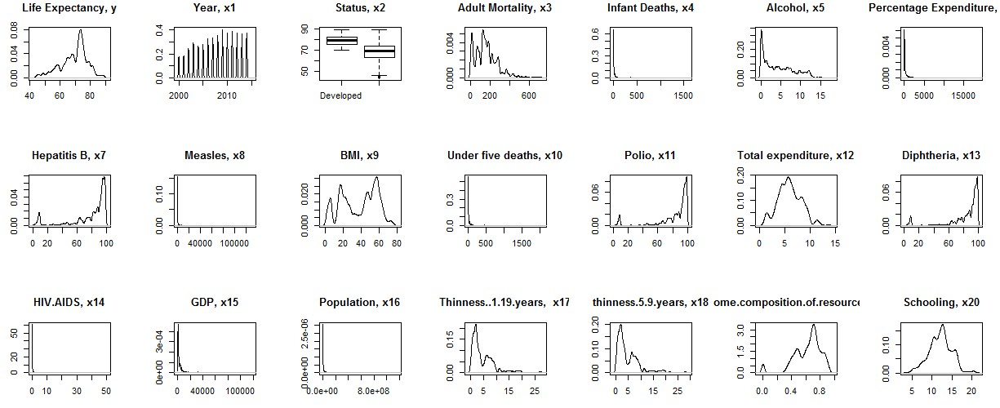

<!-- PROJECT LOGO -->
 

  <h1 align="center">Using R to Identify What Factors Influence Life Expectancy</h1>

  

     
    <a href="https://github.com/othneildrew/Best-README-Template">View R File</a>
    ·
    <a href="https://github.com/mophan/R-Regression-What-Factors-Influence-Life-Expectancy/blob/master/report-life-expectancy.docx">View Report</a>
    ·
    <a href="https://github.com/mophan/R-Regression-What-Factors-Influence-Life-Expectancy/blob/master/presentation-life-expectancy.pptx">View Presentation</a>
    ·
    <a href="https://github.com/othneildrew/Best-README-Template/issues">Download Dataset</a>
    ·
    <a href="https://github.com/mophan/R-Regression-What-Factors-Influence-Life-Expectancy/issues">Report Bug</a>
  

<!-- TABLE OF CONTENTS -->

  
Table of Contents

  <ol>
    <li>
      <a href="#about-the-project">About The Project</a>
    </li>
    <li>
      <a href="#data-description">Data Description</a>
    </li>
    <li><a href="#methodology">Methodology</a></li>
    <li><a href="#contact">Contact</a></li>
    <li><a href="#license">License</a></li>
  </ol>

<!-- ABOUT THE PROJECT -->
## About The Project

The main goal of this project is to use applications of multiple linear regression and the programming language R to create different types of multiple linear regression models learned in the class to study which factors impact on life expectancy. With this learning, we will be able to answer the question: **_Which factor should a country give importance in order to improve the life expectancy of its population?_** 

<!-- DATA DESCRIPTION -->
## Data Description

The dataset is obtained from the website https://www.kaggle.com/kumarajarshi/life-expectancy-who/version/1

There are 20 variables in the dataset which was collected for 193 countries during 16 years from 2000 to 2015. Among those, variables regarding health and life expectancy were collected from the WHO website, while the ecomonic variables were from the United Nation website.

Below are the list of all variables:

   - Life expectancy --           `Average life expectancy (age) for a country in a particular year`
   - Year
   - Status --                    `The status of country (Developed or Developing)` 
   - Adult Mortality --           `Probability of dying between 15 and 60 years per 1000 population`
   - Infant deaths --             `Number of Infant Deaths per 1000 population`
   - Alcohol --                   `Alcohol, recorded per capita (15+) consumption (in litres)`
   - Percentage Expenditure --    `Expenditure on health as a percentage of Gross Domestic Product per capita(%)`
   - Hepatitis B --               `Hepatitis B immunization coverage among 1-year-olds (%)`
   - Measles --                   `Measles - number of reported cases per 1000 population`
   - BMI --                       `Average Body Mass Index of entire population`
   - Under-five deaths --         `Number of under-five deaths per 1000 population`
   - Polio --                     `Polio immunization coverage among 1-year-olds (%)`
   - Total expenditure --         `Government expenditure on health as a percentage of total government expenditure (%)`
   - Diphtheria --                `Diphtheria tetanus toxoid and pertussis immunization coverage among 1-year-olds`
   - HIV/AIDS --                  `Deaths per 1000 live births HIV/AIDS (0-4 years)`
   - GDP --                       `Gross Domestic Product per capita (in USD)`
   - Population --                `Population of the country`
   - Thinness 10-19 years --      `Prevalence of thinness among children and adolescents for Age 10-19` 
   - Thinness 5-9 year --         `Prevalence of thinness among children for Age 5-9`
   - Income composition --        `Human Development Index in terms of income of resources composition (from 0 to 1)`
   - Schooling --                 `Number of years of schooling`

Life expectancy is the response variable, and the rest are the predictors.

### Distribution of Variables

<!-- METHODOLOGY -->
## Methodology

Use the application of linear regression and R to

1. Fit a full model with all input variables and the output variable - life expectancy
2. Obtain the best subset of variables using adjusted R-squared, AIC, AICc, BIC
3. Fit other regression models with the best subset of variables and transformed variabled which have abnormal original distribution 
4. Compare between models to find the most accurate result using adjusted R-squared, AIC, AICc, BIC, MAPE  

_For more examples, please refer to the [R file](https://example.com), the [Project Report](https://github.com/mophan/R-Regression-What-Factors-Influence-Life-Expectancy/blob/master/report-life-expectancy.docx), the [Project Presentation](https://github.com/mophan/R-Regression-What-Factors-Influence-Life-Expectancy/blob/master/presentation-life-expectancy.pptx)_

<!-- CONTACT -->
## Contact

Mo Phan - helen.dreamsbigdreams@gmail.com

Project Link: [https://github.com/mophan/R-Regression-What-Factors-Influence-Life-Expectancy](https://github.com/mophan/R-Regression-What-Factors-Influence-Life-Expectancy)

<!-- LICENSE -->
## License

Distributed under the MIT License. See `LICENSE` for more information.

<!-- MARKDOWN LINKS & IMAGES -->
<!-- https://www.markdownguide.org/basic-syntax/#reference-style-links -->

